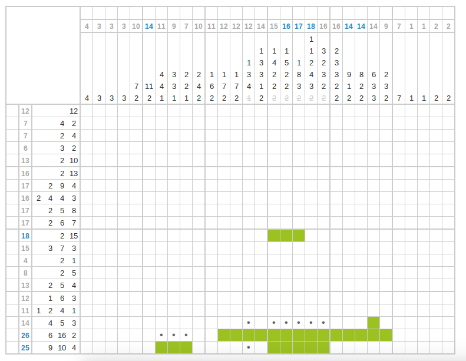

Logic puzzle app
================

Redesign
--------

1. ~~rework html for puzzle~~
2. build puzzle from file (parse string) (use angular)
3. add user interaction via FRP

Later
-----

* create input page for new puzzles

Old TODOs
---------

* ~~js refactoring~~ (part one done)
* ~~support swiping (fill multiple cells in one go)~~
* ~~auto marker~~
* add sass
* decouple hard coded css formatting
* create tests
* back button (implement router)
* save puzzle (local store)
* create proper documentation (readme)
* highlight solvable number ;)
* highlight line + row under cursor
* recognize crossed out values
* recognize errors
* recognize complete rows
* auto-solve known parts
* remove lines when solved
* multiple colors
* use Haskell for the core (somehow...)
* create a list page to select different puzzles

